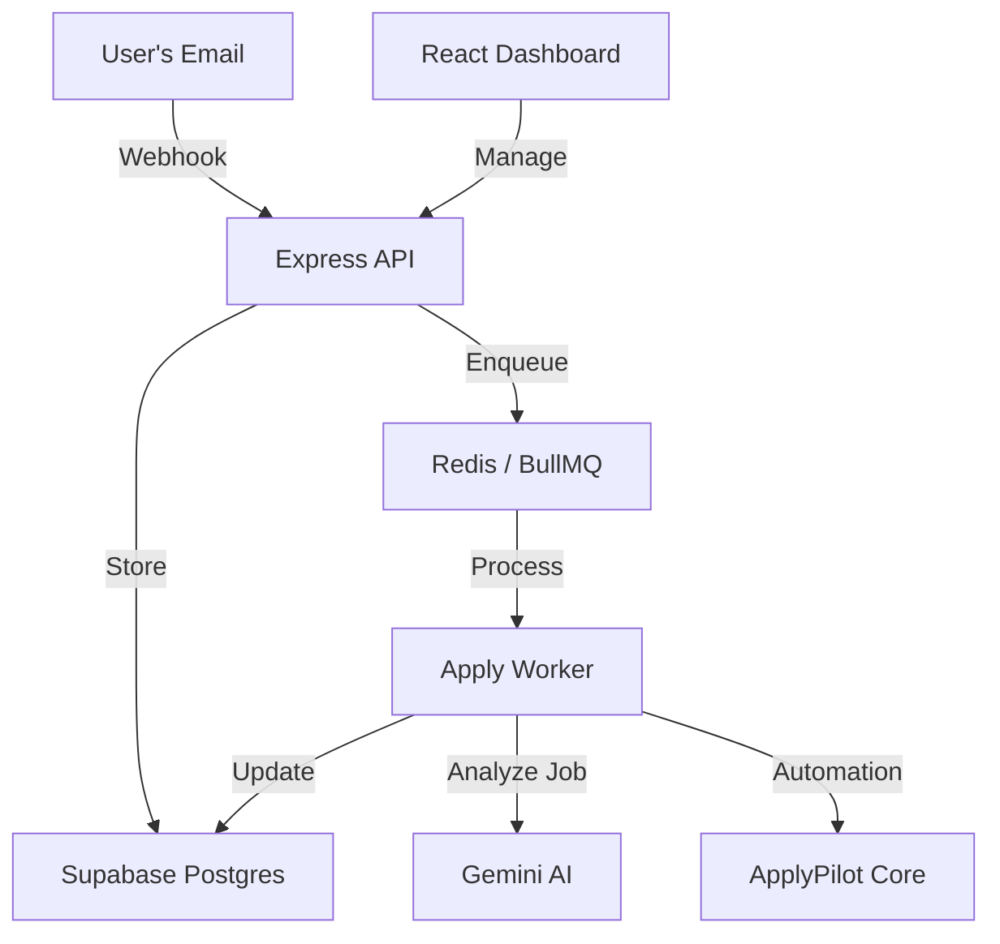

# ApplyPilot Architecture

ApplyPilot is designed as a distributed, event-driven application for job automation.

## System Overview

## Key Components

### 1. Webhook Handlers (`/webhook`)
Receives incoming email notifications (via Resend or similar). It extracts job URLs, detects the platform, deduplicates entries, and enqueues tasks for processing.

### 2. Application Queue (`BullMQ`)
Manages asynchronous processing of job applications. It handles retries with exponential backoff and provides horizontal scaling capabilities.

### 3. Apply Worker
The core logic that:
- Fetches user resume data.
- Uses Gemini AI to analyze job descriptions and match them with the user's profile.
- Orchestrates the automation script to perform the actual application.

### 4. API Layer
Provides a secure REST interface for the frontend to manage applications, track progress, and store encrypted API keys.

### 5. Security
- **Encryption**: API keys are encrypted at rest using AES-256-GCM.
- **Authentication**: JWT-based auth via Supabase.
- **RLS**: Row-Level Security in Postgres ensures data isolation between users.
